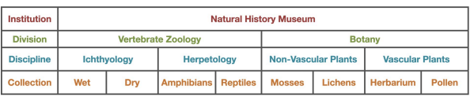
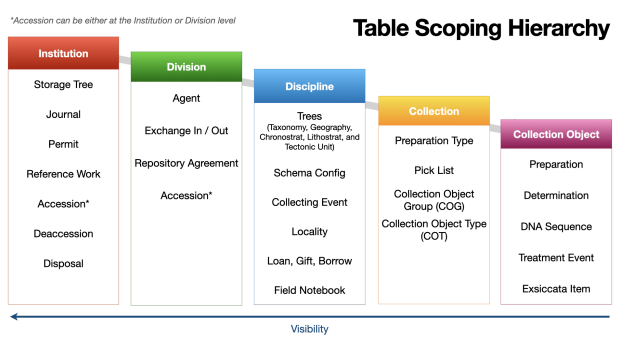

# Database Setup Strategy in Specify

## Introduction

UniMus:Natur must decide how to structure our databases in Specify. Options range from a single database for all museums and collections to one database per collection at every museum. This setup impacts data standardization, backup regimes, and user roles.

> See also: [Risk Assessment](risk_assessment.md) for a detailed breakdown of risks associated with these options.

## Specify Hierarchy

Each database (termed an "Institution" in Specify) can be divided into:
1.  **Divisions**
2.  **Disciplines**
3.  **Collections**

Initially, the decision focuses on the number of databases/institutions. Decisions regarding lower-level subdivisions will be made subsequently.

## Data Scope

The setup determines which data tables are shared. Some data is shared between Collections, others between Disciplines, and some between Divisions. However, to share data (e.g., in a Person module), the entities must reside in the same database (Institution). No data is mechanically shared between separate databases.

## Considerations

### Pros and Cons of Sharing

**According to Specify:**
*   **Data Sharing**: reduces entry errors and standardizes data. However, errors are propagated to all collections, and user permissions can become complex.
*   **Backup and Restore**: A major disadvantage of a shared database is the "all or nothing" restore. If one collection needs a rollback, the entire database (and all other collections) must be rolled back.
*   **Standardization**: Easier to implement standards (e.g., SQL updates) across multiple collections in a single database.
*   **Risk**: Modifications intended for one collection might accidentally affect others.

### Options for UniMus:Natur

1.  **One database** for all museums and all collections.
2.  **One database per museum** (5 databases), further divided into Divisions, etc.
3.  **One database per main organism group** (e.g., Botany, Entomology, Zoology, Geology) across all museums (4 databases).
4.  **One database per main organism group per museum** (20 databases).
5.  **One database per collection** at each museum (~60 databases).

### Trade-offs

**Low Fragmentation (Few Databases):**
*   *Pros:* Benefits from data standardization; quality improvements benefit everyone. Shared resources (like Person IDs) are available to all.
*   *Cons:* harder to administer, potentially large technical size affecting performance, errors affect everyone. Less flexibility for UI customization per museum. Storage trees and permissions are shared.

**High Fragmentation (Many Databases):**
*   *Pros:* Greater control over own data and UI, easier administration per unit.
*   *Cons:* Hard to link objects between collections (e.g., Tissue sample in one DB, Voucher in another). Queries cannot be shared. Users needing access to multiple collections need multiple logins/accounts.
*   *Mitigation:* Some issues can be mitigated by developing external tools (e.g., using APIs to sync Person modules).

## Case Studies

*   **Denmark**: Uses Specify at 8 natural history museums with **one database per institution**.
*   **University of Kansas**: Decided on **separate databases for each collection** 20 years ago. They now regret this; fears of over-sharing were unfounded, and rollback needs have been minimal (approx. twice in 20 years).
*   **Royal Botanical Garden Edinburgh**: Went to the other extreme, merging all physical collections (vascular plants, mosses, lichens, fungi) into a **single Collection** within Specify.
